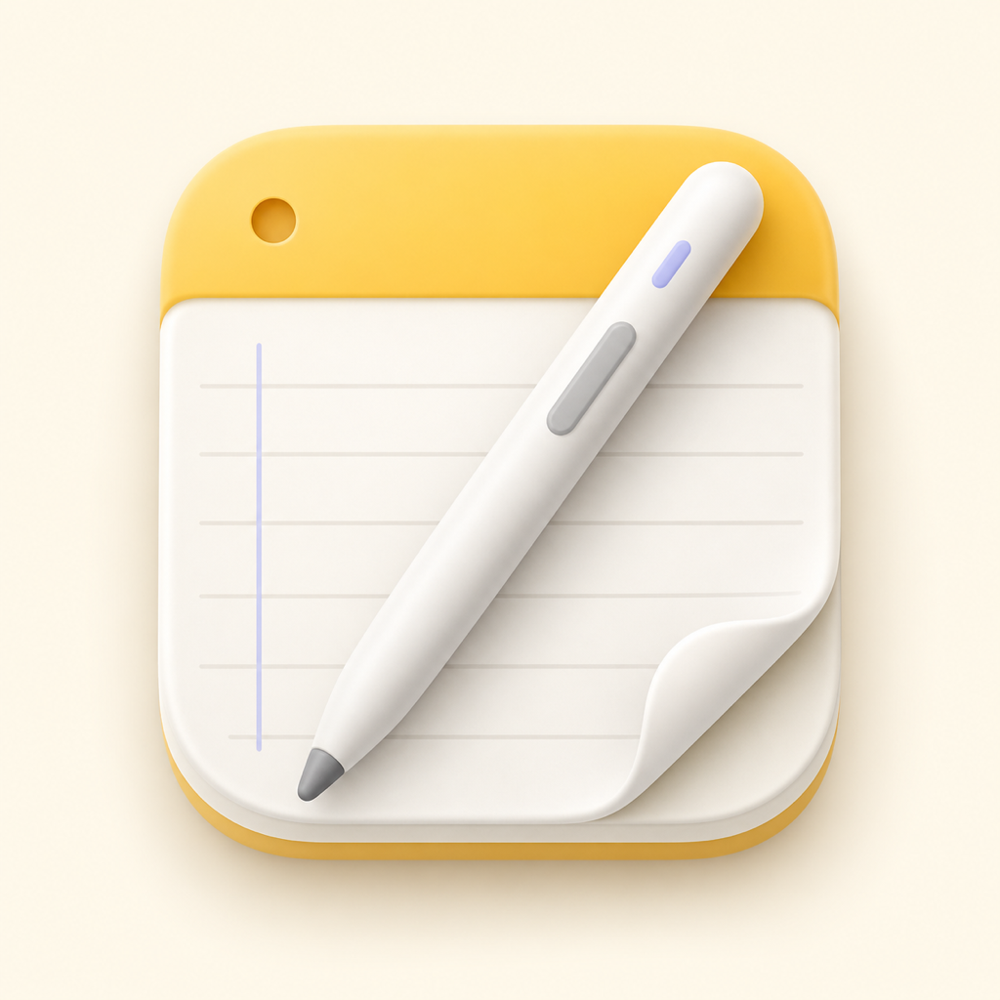

<div align="center">
  

  # NoteMD

  Editor Markdown local para macOS.
</div>

## Funções

- Organização de notas em notebooks.
- Edição em Markdown, modo visual ou vista dividida com pré-visualização.
- Abertura e edição direta de ficheiros `.md` externos.
- Gravação automática, recuperação de rascunhos e histórico de versões.
- Pesquisa por título, conteúdo e tags.
- Tags, cores e vários separadores abertos.
- Formatação de títulos, listas, tarefas, citações, ligações, tabelas e código.
- Inserção de imagens locais através de colar ou seleção de ficheiro.
- Contagem de palavras, caracteres e linhas.
- Exportação para PDF.
- Interface em português, inglês e francês.

## Armazenamento

As notas são guardadas localmente na pasta escolhida pelo utilizador:

```text
Pasta das notas/
└── Notebook/
    └── Nota/
        ├── note.md
        ├── .note.json
        └── assets/
```

Ficheiros Markdown externos permanecem no local original. O NoteMD não exige
conta nem envia notas para serviços externos.

## Requisitos

- macOS 14 ou posterior.
- Swift 6 para compilação a partir do código-fonte.

## Compilar

```shell
swift build -c release
```

O executável é criado em `.build/arm64-apple-macosx/release/NoteMD`.

## Licença

Consulte [LICENSE](LICENSE).
